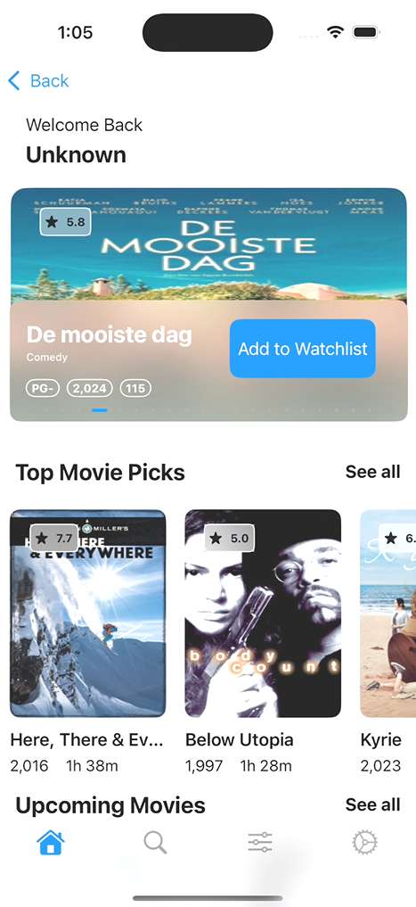
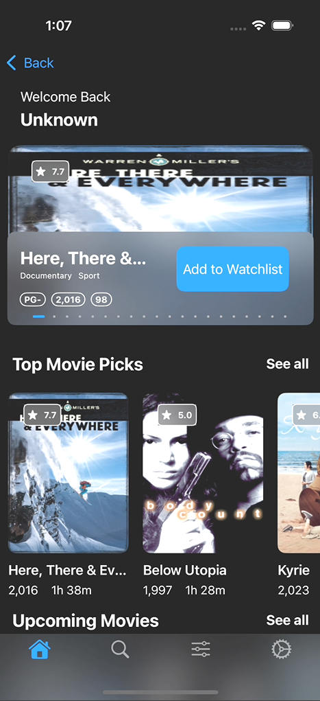
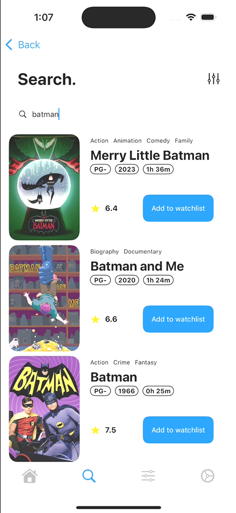
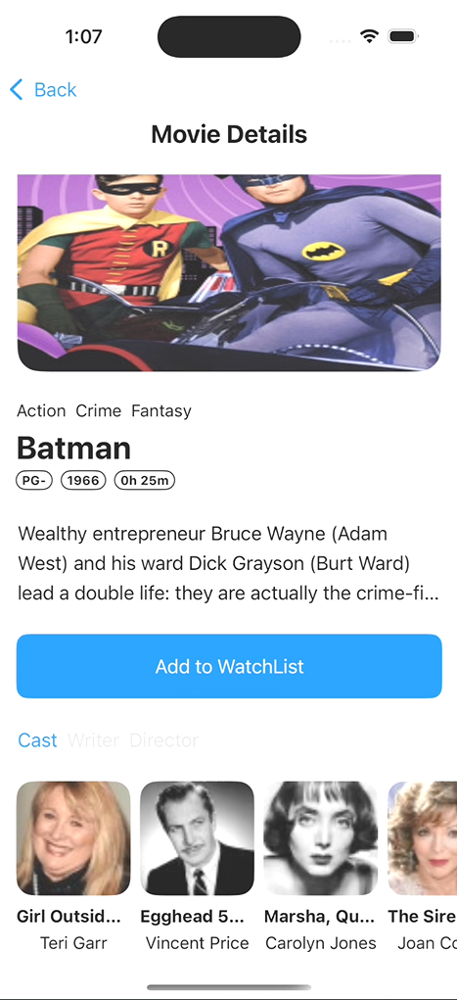
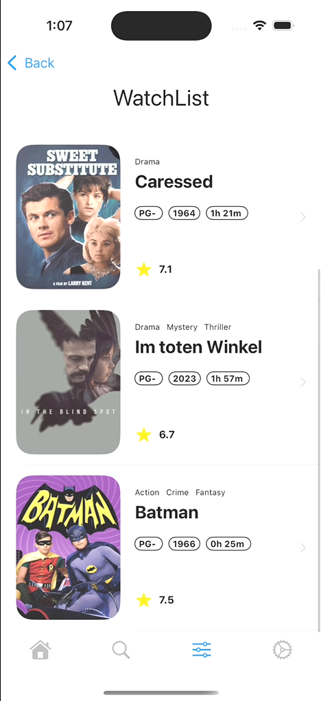
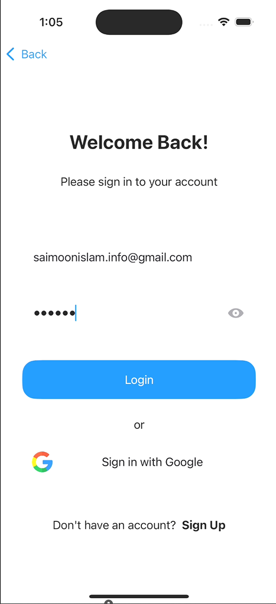

# Cinemo 
A Movie Database iOS Application featuring latest and upcoming movies. 

# Features
- Movie List Home Page 
- Movie Details Page
- Movie Search and Filtering
- Movie Bookmark Page
- Settings Page
- Login/ Signup
- Localization Support(Bangla/English)
- App Theming (Light/Dark)
- MVVM and Repository Pattern

 

# Build and Run 
1. Clone the GitHub repository to you machine by using git `https://github.com/siam-sharif-ami/Cinemo.git`
2. Download Xcode to run the project

 

# Screenshots
**Home Page**

  
  

 

**Search Page** and **Details Page**

  
  

 

**Watchlists** and **Login**

  
  

 

# Demonstration

  

